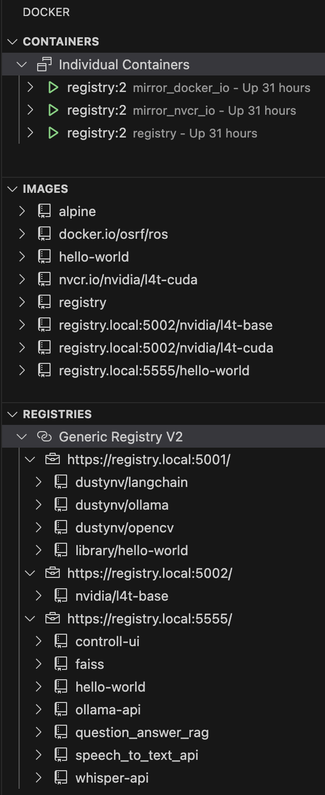

# Local Container Registry and mirrors for Jetson (here: on `MACOS` platform)

## Add folders
```
mkdir ~/docker/registry
mkdir ~/docker/mirror_docker_io
mkdir ~/docker/mirror_nvcr_io
mkdir ~/docker/certs
mkdir ~/docker/config
```
  
## Add DNS entry to hosts on `MACOS`
```
sudo nano /etc/hosts
```
add `127.0.0.1 registry.local` and/or `127.0.0.1 mirror.local` 

## Generate certificate (use newer `openssl`, to get `MACOS` compatible certificates)  
```
brew install openssl
cd ~/docker/certs

# this did not work:  
# openssl req -newkey rsa:4096 -nodes -sha256 -keyout domain.key -x509 -days 3650 -out domain.crt

/opt/homebrew/opt/openssl@3.4/bin/openssl req -x509 -nodes -newkey rsa:2048 \
  -keyout domain.key -out domain.crt \
  -subj "/CN=registry.local" \
  -addext "subjectAltName=DNS:registry.local" \
  -days 3650

sudo security add-trusted-cert -d -r trustRoot -k /Library/Keychains/System.keychain ~/docker/certs/domain.crt

# each registry and mirror needs a separate entry (5001: docker.io, 5002: nvcr.io, 5555: registry)
mkdir -p ~/Library/Group\ Containers/group.com.docker/certs.d/registry.local:5001
mkdir -p ~/Library/Group\ Containers/group.com.docker/certs.d/registry.local:5002
mkdir -p ~/Library/Group\ Containers/group.com.docker/certs.d/registry.local:5555
cp domain.crt ~/Library/Group\ Containers/group.com.docker/certs.d/registry.local:5001/ca.crt
cp domain.crt ~/Library/Group\ Containers/group.com.docker/certs.d/registry.local:5002/ca.crt
cp domain.crt ~/Library/Group\ Containers/group.com.docker/certs.d/registry.local:5555/ca.crt
```

## Registry container
create `config_registry.yml` in `~/docker/config`  
```
version: 0.1
log:
  level: debug
  fields:
    service: registry
storage:
  filesystem:
    rootdirectory: /var/lib/registry
  delete:
    enabled: true
http:
  addr: :5555
  tls:
    certificate: /certs/domain.crt
    key: /certs/domain.key
```

start the container
```
docker run -d \
  --name registry \
  -p 5555:5555 \
  --restart=always \
  -v ~/docker/config/config_registry.yml:/etc/docker/registry/config.yml:ro \
  -v ~/docker/certs/domain.crt:/certs/domain.crt:ro \
  -v ~/docker/certs/domain.key:/certs/domain.key:ro \
  -v ~/docker/registry:/var/lib/registry \
  -e REGISTRY_STORAGE_DELETE_ENABLED=true \
  registry:2
```

## Mirror container (one for each external registry)
create generic `config_mirror.yml` in `~/docker/config`  
```
version: 0.1
log:
  level: debug
  fields:
    service: registry
storage:
  filesystem:
    rootdirectory: /var/lib/registry
http:
  addr: :5000
  tls:
    certificate: /certs/domain.crt
    key: /certs/domain.key
proxy:
  remoteurl:
```

start the container:  
- for docker.io:
```
docker run -d \
  --name mirror_docker_io \
  -p 5001:5000 \
  --restart=always \
  -v ~/docker/config/config_mirror.yml:/etc/docker/registry/config.yml:ro \
  -v ~/docker/certs/domain.crt:/certs/domain.crt:ro \
  -v ~/docker/certs/domain.key:/certs/domain.key:ro \
  -v ~/docker/mirror_docker_io:/var/lib/registry \
  -e REGISTRY_PROXY_REMOTEURL="https://registry-1.docker.io" \
  registry:2
```

- for nvcr.io (use real username and password):  
```
docker run -d \
  --name mirror_nvcr_io \
  -p 5002:5000 \
  --restart=always \
  -v ~/docker/config/config_mirror.yml:/etc/docker/registry/config.yml:ro \
  -v ~/docker/certs/domain.crt:/certs/domain.crt:ro \
  -v ~/docker/certs/domain.key:/certs/domain.key:ro \
  -v ~/docker/mirror_nvcr_io:/var/lib/registry \
  -e REGISTRY_PROXY_REMOTEURL="https://nvcr.io" \
  -e REGISTRY_PROXY_USERNAME="$oauthtoken" \
  -e REGISTRY_PROXY_PASSWORD="MTZ..." \
  registry:2
```

## Docker on `MACOS`
Modify `daemon.json` and restart via UI:  
```
{
  "insecure-registries": [],
  "registry-mirrors": [
    "https://registry.local:5001",
    "https://registry.local:5002"
  ]
}
```

## Test
Check website for valid certificate:  
```
cd ~/docker/certs
curl -v --cacert domain.crt https://registry.local:5001/v2/
curl -v --cacert domain.crt https://registry.local:5002/v2/
curl -v --cacert domain.crt https://registry.local:5555/v2/
```

Pull/push test images (use `library` as namespace for `docker.io`):  
```
docker pull registry.local:5001/library/hello-world:latest
docker pull registry.local:5002/nvidia/l4t-base:r36.2.0

docker tag hello-world registry.local:5555/hello-world
docker push registry.local:5555/hello-world

docker pull registry.local:5555/hello-world
```

## Jetson  
Add DNS entry to hosts:  
```
sudo nano /etc/hosts
```
Insert one or two entries:  
```
127.0.0.1 registry.local
127.0.0.1 mirror.local
```

Copy crt file e.g. to git folder by using VSCode Remote and register ca cert for each endpoint:
```
sudo mkdir -p /etc/docker/certs.d/registry.local:5001
sudo mkdir -p /etc/docker/certs.d/registry.local:5002
sudo mkdir -p /etc/docker/certs.d/registry.local:5555
sudo cp domain.crt /etc/docker/certs.d/registry.local:5001/ca.crt
sudo cp domain.crt /etc/docker/certs.d/registry.local:5002/ca.crt
sudo cp domain.crt /etc/docker/certs.d/registry.local:5555/ca.crt
sudo chmod 644 /etc/docker/certs.d/registry.local:5001/ca.crt
sudo chmod 644 /etc/docker/certs.d/registry.local:5002/ca.crt
sudo chmod 644 /etc/docker/certs.d/registry.local:5555/ca.crt
```

Mofify `daemon.json` and restart docker:
```
sudo nano /etc/docker/daemon.json
sudo systemctl restart docker
```

`daemon.json` content:
```
{
    "runtimes": {
        "nvidia": {
            "path": "nvidia-container-runtime",
            "runtimeArgs": []
        }
    },
    "default-runtime": "nvidia",
    "data-root": "/mnt/nova_ssd/docker",
    "registry-mirrors": [
        "https://registry.local:5001",
        "https://registry.local:5002"
    ]
}
```

Remark:  
Only `docker.io` images are cached by the proxy automatically.
`nvcr.io` images for example have to be loaded using `registry.local:5002/nvidia/<image>:<tag>` and are then getting cached.  

Push locally built images to registry:  
```
docker tag abc registry.local:5555/abc
docker push registry.local:5555/abc

docker tag faiss:r36.4.0-cu126 registry.local:5555/faiss:r36.4.0-cu126
docker push registry.local:5555/faiss:r36.4.0-cu126
```

## Result on `MACOS`

Filesystem:
```
docker
├── certs
│   ├── domain.crt
│   └── domain.key
├── config
│   ├── config_mirror.yml
│   └── config_registry.yml
├── mirror_docker_io
├── mirror_nvcr_io
└── registry
```

Docker tree:  


